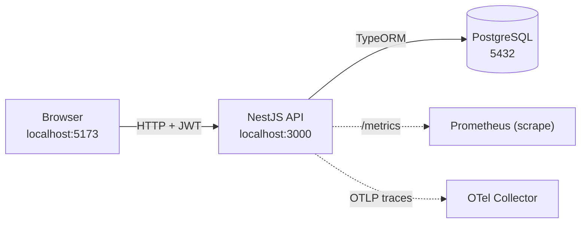
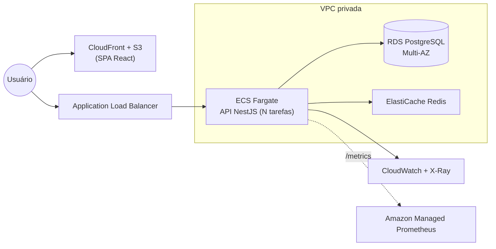

# Teddy: Sistema de Clientes

Sistema de gestão de clientes com login, CRUD (com soft delete), dashboard,
contador de acessos e auditoria. É um monorepo Nx com dois apps independentes:
a API em NestJS e o front em React.

Desafio técnico de Tech Lead Pleno da Teddy Open Finance.

## Stack

| Camada | Tecnologias |
|--------|-------------|
| Front-end | React 19 + Vite + TypeScript, React Router, TanStack Query, Zustand, React Hook Form + Zod, Recharts |
| Back-end | NestJS 11 + TypeORM + PostgreSQL, JWT (passport), class-validator, Swagger |
| Observabilidade | `/healthz` (Terminus), `/metrics` (Prometheus), logs JSON (pino), traces (OpenTelemetry) |
| Infra | Docker + docker-compose, Nx, GitHub Actions |

## Estrutura do monorepo

```
teddy/
├── apps/
│   ├── back-end/        # API NestJS (auth, clients, health, metrics, observability)
│   │   ├── Dockerfile
│   │   ├── docker-compose.yml
│   │   ├── .env.example
│   │   └── README.md
│   └── front-end/       # SPA React + Vite
│       ├── Dockerfile
│       ├── docker-compose.yml
│       ├── .env.example
│       └── README.md
├── .github/workflows/   # CI separado FE/BE
├── docker-compose.yml   # sobe tudo (postgres + api + web)
└── docs/                # diagramas de arquitetura
```

## Arquitetura local



## Arquitetura na AWS



O front é estático, então vai para o S3 servido pelo CloudFront. A API roda no
ECS Fargate atrás de um load balancer e escala adicionando tarefas conforme a
carga. Os dados ficam no RDS Postgres em Multi-AZ (failover automático) e o
Redis do ElastiCache entra quando precisar de cache ou contadores mais rápidos.
Logs, métricas e traces vão para CloudWatch, Managed Prometheus e X-Ray. Os
segredos (JWT, banco) ficam no Secrets Manager.

## Como rodar

### Com Docker

```bash
docker compose up --build
```

- Front: http://localhost:5173
- API: http://localhost:3000, Swagger em http://localhost:3000/docs
- Postgres: localhost:5432

O usuário admin é criado no primeiro boot: `admin@teddy.com` / `admin123`. Dá
para mudar em `ADMIN_EMAIL` e `ADMIN_PASSWORD`. As migrations rodam sozinhas
quando a API sobe.

### Local

```bash
npm ci
cp apps/back-end/.env.example apps/back-end/.env   # ajuste DATABASE_URL
npx nx serve back-end     # API em :3000
npx nx serve front-end    # SPA em :5173
```

Se quiser só o banco: `docker compose up postgres`.

## Endpoints

| Método | Rota | Auth | Descrição |
|--------|------|------|-----------|
| POST | `/auth/login` | não | Autentica por e-mail/senha e retorna o JWT |
| POST | `/clients` | sim | Cria cliente |
| GET | `/clients` | sim | Lista paginada (`page`, `limit`, `search`) |
| GET | `/clients/stats` | sim | Totais, últimos clientes e série do gráfico |
| GET | `/clients/:id` | sim | Detalhe e incremento do contador de acessos |
| PUT | `/clients/:id` | sim | Atualiza cliente |
| DELETE | `/clients/:id` | sim | Soft delete |
| GET | `/healthz` | não | Healthcheck (verifica o banco) |
| GET | `/metrics` | não | Métricas Prometheus |
| GET | `/docs` | não | Swagger UI |

## Observabilidade

Por que cada peça está aqui:

- Logs em JSON são lidos por máquina. Ferramentas como CloudWatch, Loki ou ELK
  conseguem buscar e alertar por campo, e a gente correlaciona por request-id.
- O `/healthz` deixa o orquestrador (ECS, Kubernetes) mandar tráfego só para as
  instâncias saudáveis e reiniciar as que caíram.
- O `/metrics` expõe séries temporais (latência, throughput, erros,
  `client_views_total`) para dashboards e alertas.
- Os traces do OpenTelemetry seguem uma requisição por todas as camadas e
  mostram onde está o gargalo. Ligue com `OTEL_ENABLED=true`.

## Escalabilidade

- A API é stateless (usa JWT), então escala na horizontal: é só subir mais
  tarefas atrás do load balancer.
- No banco, o RDS Multi-AZ dá alta disponibilidade. Read replicas e pool de
  conexões entram quando o volume crescer. Paginação e índices já evitam full
  scan desde o MVP.
- O Redis serve de cache e ajuda nos contadores sob carga alta. Hoje o contador
  de acessos é uma coluna atômica no Postgres, o que já resolve para o MVP.
- O front é estático e sai pela CDN, com custo e latência baixos.
- No CI, o Nx roda build e teste por projeto e usa `affected` para não
  reprocessar o que não mudou.

## Testes e qualidade

```bash
npx nx run-many -t test     # unitários FE + BE
npx nx run-many -t lint     # ESLint
npx nx run-many -t build    # builds de produção
```

ESLint e Prettier, commits semânticos (commitlint + husky) e CI no GitHub
Actions com pipelines separados para front e back.
