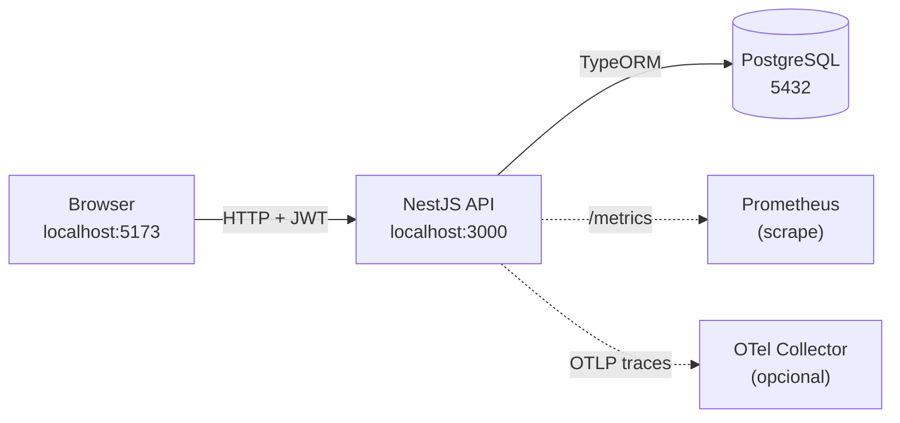
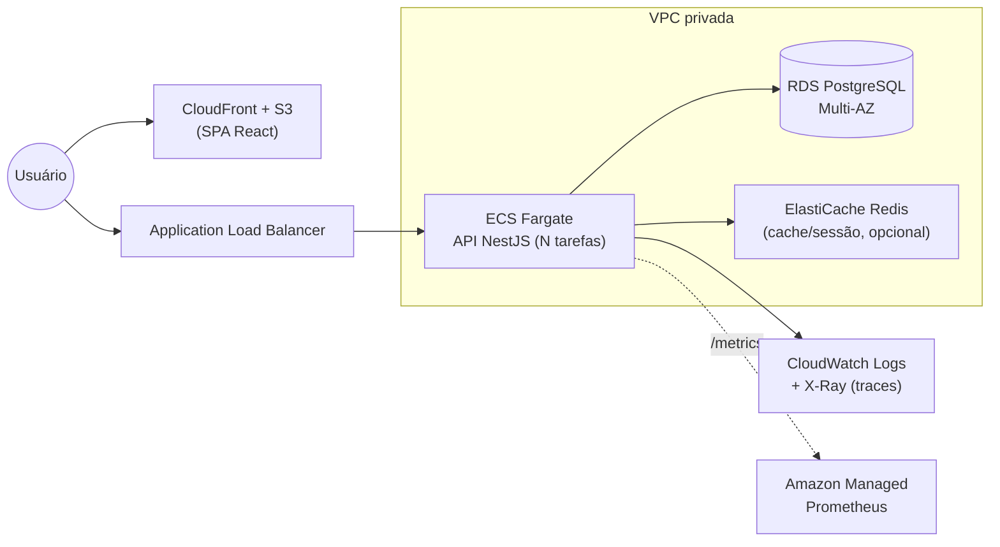

# Teddy — Sistema de Clientes

MVP full-stack de gestão de clientes (login, CRUD com soft delete, dashboard,
contador de acessos, auditoria e observabilidade), entregue como **monorepo Nx**
com dois aplicativos independentes.

> Desafio Técnico — Tech Lead Pleno | Teddy Open Finance.

## Stack

| Camada | Tecnologias |
|--------|-------------|
| Front-end | React 19 + Vite + TypeScript, React Router, TanStack Query, Zustand, React Hook Form + Zod, Recharts |
| Back-end | NestJS 11 + TypeORM + PostgreSQL, JWT (passport), class-validator, Swagger |
| Observabilidade | `/healthz` (Terminus), `/metrics` (Prometheus), logs JSON (pino), traces (OpenTelemetry) |
| Infra | Docker + docker-compose, Nx, GitHub Actions |

## Estrutura do monorepo

```
teddy/
├── apps/
│   ├── back-end/        # API NestJS (auth, clients, health, metrics, observability)
│   │   ├── Dockerfile
│   │   ├── docker-compose.yml
│   │   ├── .env.example
│   │   └── README.md
│   └── front-end/       # SPA React + Vite
│       ├── Dockerfile
│       ├── docker-compose.yml
│       ├── .env.example
│       └── README.md
├── .github/workflows/   # CI separado FE/BE
├── docker-compose.yml   # sobe tudo (postgres + api + web)
└── docs/                # diagramas de arquitetura
```

## Arquitetura (visão local)



## Arquitetura (proposta AWS)



O front (estático) vai para **S3 + CloudFront** (CDN global, cache de borda). A
API roda em **ECS Fargate** atrás de um **ALB**, escalando horizontalmente por
CPU/memória/requisições. Estado fica no **RDS Postgres Multi-AZ** (failover
automático) e num **ElastiCache Redis** opcional para cache/contadores. Logs,
métricas e traces vão para **CloudWatch / Managed Prometheus / X-Ray**.
Secrets (JWT, DB) no **Secrets Manager**.

## Como rodar

### Docker (tudo de uma vez)

```bash
docker compose up --build
```

- Front: http://localhost:5173
- API: http://localhost:3000 · Swagger: http://localhost:3000/docs
- Postgres: localhost:5432

O usuário admin é criado automaticamente no primeiro boot:
`admin@teddy.com` / `admin123` (configurável via `ADMIN_EMAIL` / `ADMIN_PASSWORD`).

As migrations rodam sozinhas na subida da API (`migrationsRun: true`).

### Local (desenvolvimento)

```bash
npm ci
cp apps/back-end/.env.example apps/back-end/.env   # ajuste DATABASE_URL
npx nx serve back-end     # API em :3000
npx nx serve front-end    # SPA em :5173 (Vite dev) — ajuste VITE_API_URL se preciso
```

Para subir só o banco: `docker compose up postgres`.

## Endpoints principais

| Método | Rota | Auth | Descrição |
|--------|------|------|-----------|
| POST | `/auth/login` | — | Autentica (e-mail/senha) e retorna JWT |
| POST | `/clients` | ✅ | Cria cliente |
| GET | `/clients` | ✅ | Lista paginada (`page`, `limit`, `search`) |
| GET | `/clients/stats` | ✅ | Totais, últimos e série do gráfico |
| GET | `/clients/:id` | ✅ | Detalhe + incrementa contador de acessos |
| PUT | `/clients/:id` | ✅ | Atualiza cliente |
| DELETE | `/clients/:id` | ✅ | Soft delete |
| GET | `/healthz` | — | Healthcheck (verifica o banco) |
| GET | `/metrics` | — | Métricas Prometheus |
| GET | `/docs` | — | Swagger UI |

## Observabilidade — por que importa

- **Logs estruturados (JSON)**: legíveis por máquina (CloudWatch, Loki, ELK),
  permitem busca/alerta por campo e correlação por request-id. Texto livre não escala.
- **`/healthz`**: o orquestrador (ECS/K8s) só roteia tráfego para instâncias
  saudáveis e reinicia as que falham — base para deploys sem downtime.
- **`/metrics` (Prometheus)**: séries temporais (latência, throughput, erros,
  `client_views_total`) habilitam dashboards e alertas proativos antes do usuário sentir.
- **Traces (OpenTelemetry)**: seguem uma requisição por todas as camadas,
  localizando o gargalo exato em sistemas distribuídos. Habilite com `OTEL_ENABLED=true`.

## Escalabilidade

- **Stateless**: a API não guarda sessão em memória (JWT), então escala
  horizontalmente — basta adicionar tarefas atrás do load balancer.
- **Banco**: RDS Multi-AZ para HA; read replicas e connection pooling quando o
  volume crescer. Índices e paginação já no MVP evitam full scans.
- **Cache**: Redis (ElastiCache) para respostas quentes e contadores de acesso
  sob alta carga (hoje o contador é uma coluna atômica no Postgres).
- **Front**: assets estáticos servidos por CDN (CloudFront), custo e latência baixos.
- **Nx**: build/test por projeto e `affected` no CI evitam reprocessar o que não mudou.

## Testes & qualidade

```bash
npx nx run-many -t test     # unitários FE + BE
npx nx run-many -t lint     # ESLint
npx nx run-many -t build    # builds de produção
```

ESLint + Prettier, commits semânticos (commitlint + husky) e CI no GitHub Actions
com pipelines separados para front-end e back-end.
