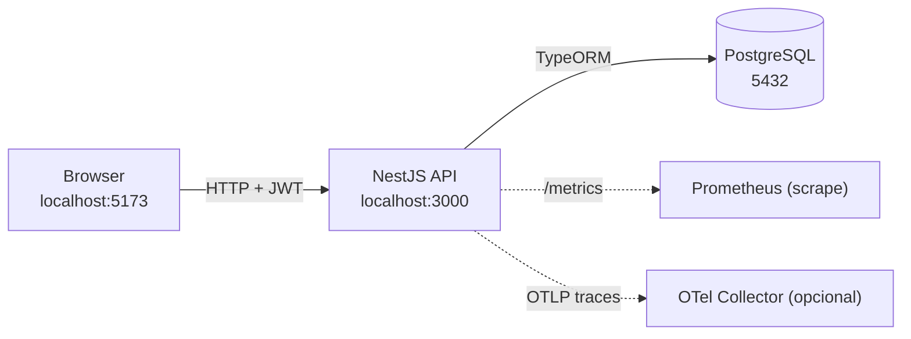
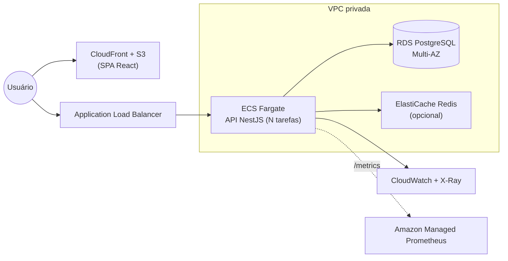
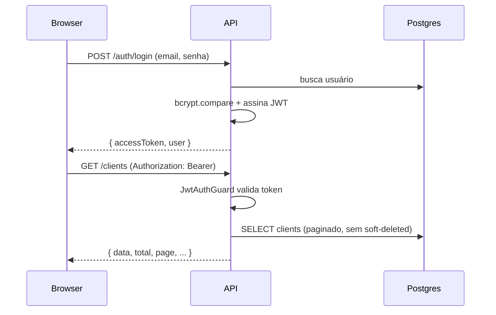

# Arquitetura

Diagramas renderizados nativamente pelo GitHub (Mermaid). Fontes reutilizáveis
para exportar como imagem, se necessário.

## Local

```mermaid
flowchart LR
  Browser["Browser<br/>localhost:5173"] -->|HTTP + JWT| API["NestJS API<br/>localhost:3000"]
  API -->|TypeORM| PG[("PostgreSQL<br/>5432")]
  API -.->|/metrics| Prom["Prometheus (scrape)"]
  API -.->|OTLP traces| Otel["OTel Collector (opcional)"]
```

## Proposta AWS

```mermaid
flowchart LR
  User(("Usuário")) --> CF["CloudFront + S3<br/>(SPA React)"]
  User --> ALB["Application Load Balancer"]
  ALB --> ECS["ECS Fargate<br/>API NestJS (N tarefas)"]
  ECS --> RDS[("RDS PostgreSQL<br/>Multi-AZ")]
  ECS --> EC["ElastiCache Redis<br/>(opcional)"]
  ECS --> CW["CloudWatch + X-Ray"]
  ECS -.->|/metrics| AMP["Amazon Managed Prometheus"]
  subgraph VPC["VPC privada"]
    ECS
    RDS
    EC
  end
```

## Fluxo de autenticação

```mermaid
sequenceDiagram
  participant U as Browser
  participant A as API
  participant DB as Postgres
  U->>A: POST /auth/login (email, senha)
  A->>DB: busca usuário
  A->>A: bcrypt.compare + assina JWT
  A-->>U: { accessToken, user }
  U->>A: GET /clients (Authorization: Bearer)
  A->>A: JwtAuthGuard valida token
  A->>DB: SELECT clients (paginado, sem soft-deleted)
  A-->>U: { data, total, page, ... }
```
